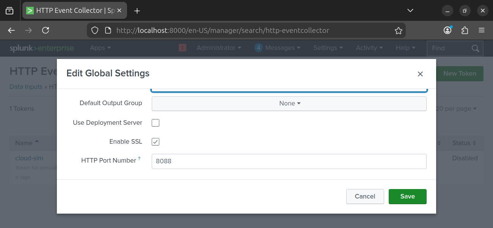
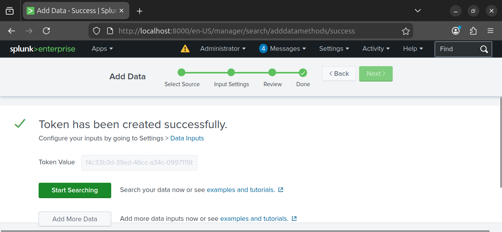
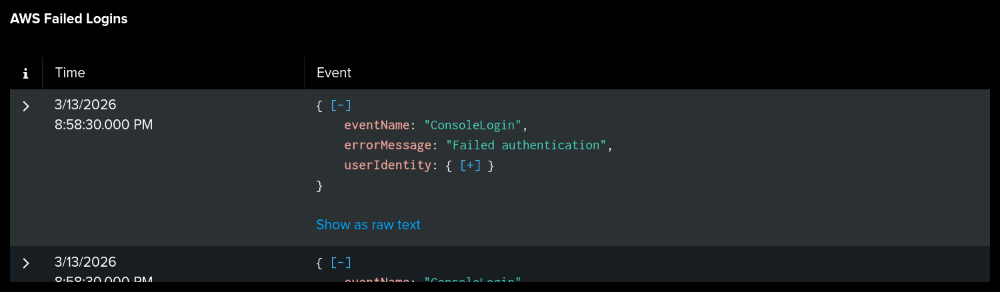
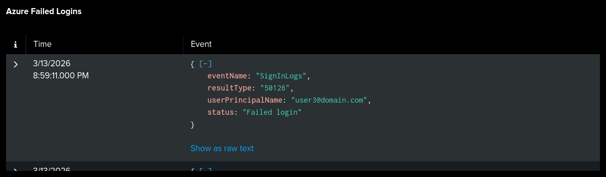
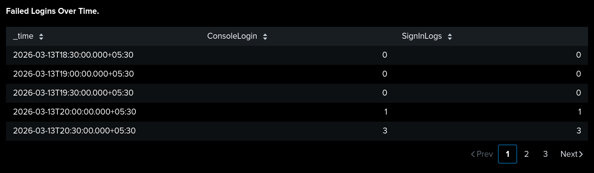
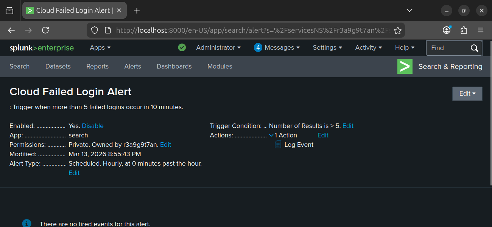
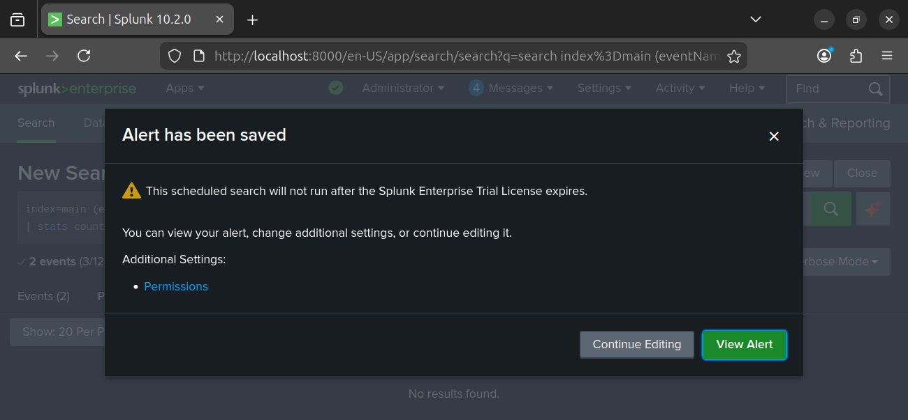

# 🌩️ Cloud Security Basics – Phase 8

## 📖 Introduction
This manual is designed for **absolute beginners** who want to learn cloud security from scratch.  
It explains the fundamentals of cloud computing, introduces key security concepts, and provides a **hands‑on lab project** to practice monitoring cloud login events using Splunk.

---

## 🧩 Key Concepts
- [Cloud Computing](https://azure.microsoft.com/en-us/resources/cloud-computing-dictionary/what-is-cloud-computing/) – delivery of computing services over the internet.
- [AWS (Amazon Web Services)](https://aws.amazon.com/what-is-aws/) – world’s largest cloud provider.
- [Microsoft Azure](https://azure.microsoft.com/en-us/overview/what-is-azure/) – Microsoft’s cloud platform.
- [Identity & Access Management (IAM)](https://docs.aws.amazon.com/IAM/latest/UserGuide/introduction.html) – managing users and permissions.
- [Authentication](https://learn.microsoft.com/en-us/azure/active-directory/fundamentals/authentication-overview) – verifying user identity.
- [Failed Login](https://learn.microsoft.com/en-us/azure/active-directory/authentication/tutorial-risk-based-conditional-access) – unsuccessful login attempt.
- [SIEM (Security Information and Event Management)](https://www.splunk.com/en_us/data-insider/what-is-siem.html) – monitoring and analyzing security events.
- [Splunk](https://www.splunk.com/en_us/software/splunk-enterprise.html) – SIEM tool used in this lab.
- [HEC (HTTP Event Collector)](https://docs.splunk.com/Documentation/Splunk/latest/Data/UsetheHTTPEventCollector) – Splunk’s method to receive events via HTTP.
- [Alert](https://docs.splunk.com/Documentation/Splunk/latest/Alert/Aboutalerts) – automated notification when suspicious activity occurs.
- [Lateral Movement](https://attack.mitre.org/tactics/TA0008/) – attacker technique to move across systems after initial access.

---

## 🛠️ Lab Project
👉 **Hands‑On Practice:** [Cloud Security Monitoring – Lab Project](https://github.com/LetsLearn-08/soc-analyst-journey/blob/ae6df15b1e4b07631632d5a403f13c50ee8cd292/Labwork.md)

This lab simulates failed login events from AWS and Azure, ingests them into Splunk, builds dashboards, and configures alerts to detect suspicious behavior.


All screenshots for Phase 8 are organized in the [`proof8`](./proof8) folder.  
This folder contains step‑by‑step visual evidence of:

- Splunk setup and HEC configuration  
- Event generation (AWS & Azure JSON logs)  
- Log ingestion into Splunk  
- Dashboard creation for failed logins  
- Alert configuration and validation  

👉 [View Proof Screenshots](./proof8)

---

## ⚙️ Lab Setup
1. Install Splunk on your SIEM VM.  
2. Enable **HEC (HTTP Event Collector)** for log ingestion.  
3. Generate test events using `curl` commands for AWS and Azure failed logins.  
4. Create dashboards to visualize login activity.  
5. Configure alerts to detect >5 failed logins.  
6. Capture proof screenshots for documentation.

---

## 🔍 Splunk Queries
### AWS Failed Logins
```spl
index=main source=aws_console
```
### Azure Failed Logins
```spl
index=main source=azure_signin
```
### Combined View
```spl
index=main (source=aws_console OR source=azure_signin)
```
Lateral Movement Detection
```spl
index=main (source=aws_console OR source=azure_signin)
| eval ip=coalesce(sourceIPAddress, ipAddress)
| iplocation ip
| stats dc(Country) as country_count values(Country) as countries by userIdentity.userName, userPrincipalName
| where country_count > 1
```
## 📊 Proof of Work – Screenshots

All screenshots for Phase 8 are stored in the [`proof8`](./proof8) folder.  
This folder contains complete visual evidence of Splunk setup, event generation, log ingestion, dashboard creation, and alert configuration.

👉 [View All Proof Screenshots](./proof8)

---

### Highlighted Screenshots

#### Splunk Setup
  
*Shows how the HTTP Event Collector (HEC) was enabled in Splunk.*

  
*Demonstrates creation of a Splunk HEC token for authentication.*

---

#### Dashboard Creation
  
*Panel showing failed AWS ConsoleLogin attempts.*

  
*Panel showing failed Azure SignInLogs events.*

  
*Timeline visualization of login attempts.*

---

#### Alert Configuration
  
*Dashboard panel showing alert conditions.*

  
*Proof of alert firing when more than five failed logins are detected.*

---

## 🏁 Summary
These screenshots serve as **proof artifacts** for the Cloud Security Monitoring lab. They demonstrate:
- Splunk setup and HEC configuration.  
- Event generation and ingestion from AWS and Azure.  
- Dashboard creation for failed logins.  
- Alert configuration and validation.  

Together, they show a complete workflow: **Cloud Events → Splunk Ingestion → Dashboard → Alert → Proof**.

---

## 🚨 Alert Configuration
- **Condition:** Trigger when more than five failed login attempts occur within a defined period.  
- **Action:** Generate and log an event into `index=main source=cloud_alerts`.  
- **Purpose:** Provides automated detection of brute force attempts or suspicious login activity across cloud environments.

---

## 🎯 Learning Outcomes
By completing this phase, learners will be able to:
- Explain the fundamentals of cloud computing.  
- Describe how login events are generated in AWS and Azure.  
- Configure Splunk HEC to ingest cloud logs.  
- Build dashboards to visualize authentication activity.  
- Implement alerts to detect abnormal or suspicious behavior.  
- Document technical proof artifacts for professional visibility.

---

## 📌 Next Steps
- Progress to **Phase 9: Malware Analysis – Payload Delivery**.  
- Explore advanced enrichment techniques (e.g., IP geolocation, MFA status).  
- Continue practicing structured documentation with screenshots and queries.

---

## 🏁 Conclusion
This phase delivers a **step‑by‑step introduction to cloud security monitoring**. Learners can replicate the lab project, gain confidence in configuring IAM and monitoring login events, and produce recruiter‑ready documentation. The linked lab project serves as practical proof of learning, bridging theoretical knowledge with hands‑on SOC skills.


## 🤝 Connect With Me
- 🌐 GitHub: [LetsLearn-08](https://github.com/LetsLearn-08?tab=repositories)  
- 💼 LinkedIn: [Tanuja Reddy](https://www.linkedin.com/in/tanuja-reddy-03aa7b38a)
