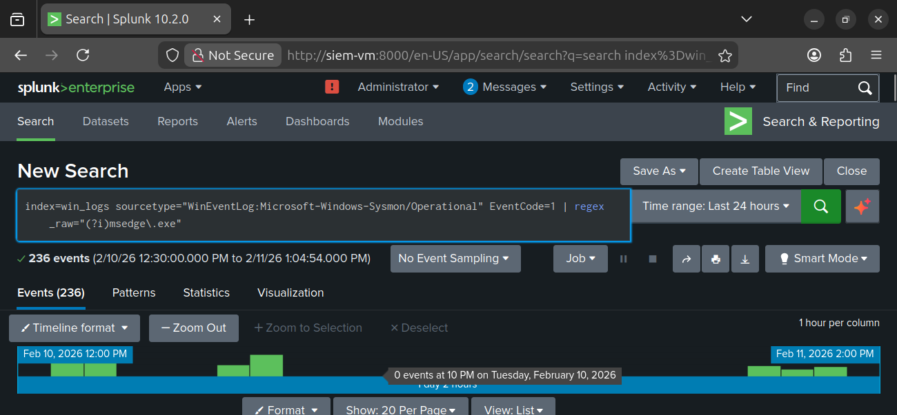
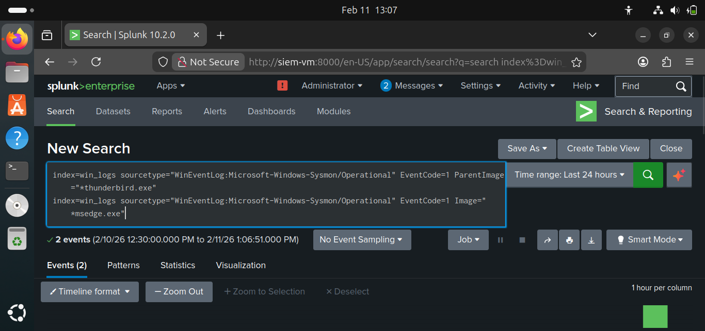

# 📨 Project 1 – Phishing Simulation (Reconnaissance)

## 📖 Scenario Overview – The Four Characters

This project simulates a real-world phishing attack and how a SOC team detects and responds to it during the **reconnaissance / initial access phase**.

- 👤 **Commoner (Employee / End User)**  
  A finance employee receives an urgent-looking invoice email. Trust and curiosity lead them to click the embedded link.

- 🎭 **Attacker (Threat Actor)**  
  Crafts a phishing email containing a malicious link to gain initial access into the environment.

- 👩‍💻 **Tier-1 Analyst (First Responder)**  
  Detects an unusual parent-child process relationship in Sysmon logs — Thunderbird spawning Microsoft Edge — and initiates triage.

- 👨‍💻 **Tier-2 Analyst (Investigator)**  
  Confirms that Edge attempted to download a suspicious executable, maps the activity to **MITRE ATT&CK T1566 (Phishing)**, and escalates the incident.

---

## 🛠️ Tools & Environment Setup

- **Sysmon**
  - Event ID **1 (Process Creation)**
  - Used to monitor parent-child process chains on endpoints

- **Splunk**
  - Ingests Sysmon logs
  - Correlation searches to detect abnormal process behavior

- **MITRE ATT&CK Mapping**
  - **T1566** – Phishing  
  - **T1078** – Valid Accounts  
  - **T1059** – Command and Scripting Interpreter  

---

## 🔍 Detection Workflow

1. **Phishing Email Delivered**  
   Employee receives and opens a malicious invoice email.

2. **User Interaction**  
   Clicking the link launches a browser from the email client.

3. **Endpoint Logging (Sysmon)**  
   - Thunderbird → Microsoft Edge process chain recorded  
   - Behavior identified as abnormal for a corporate endpoint

4. **Splunk Correlation**  
   - Query flags unusual parent-child process execution
   - Alert generated for analyst review

5. **Tier-1 Analysis**  
   - Validates alert
   - Confirms suspicious execution pattern

6. **Tier-2 Investigation**  
   - Identifies attempted download of a suspicious executable
   - Maps behavior to **T1566 (Phishing)**
   - Escalates incident for containment

---

## 📎 Evidence & Artifacts

👉 All screenshots for this lab are stored in the [project1 folder](https://github.com/LetsLearn-08/soc-analyst-journey/tree/94c3e3a456980a95f6392076c615457a3dbdbdfa/project1).  
Browse the folder directly to review the full set of evidence images.

All supporting evidence is stored in the `project1/` folder:

- `Phishing-email.png` → Malicious invoice email in Thunderbird  
- `Thunderbird-malicious-link.png` → User clicking embedded link  
- `malware download.png` → Edge attempting to download payload  
- `attacker payload.png` → Payload hosted on Kali HTTP server  
- `splunk-Thunderbird-logs-eventid-1.png` → Sysmon Event ID 1 (Process Creation)  
- `splunk-Thunderbird-logs-eventid-1,3.png` → Sysmon Event ID 1 & 3 correlation  
- `splunk-win-logs-3.png` → Sysmon Event ID 3 (Network Connection)  

---

## 🧑‍💻 Analyst Workflow

### Tier‑1 Analyst – Triage
  
*Tier‑1 analyst sees Thunderbird spawning Edge in Splunk. This unusual parent‑child process chain is escalated for deeper investigation.*

---

### Tier‑2 Analyst – Investigation
  
*Tier‑2 analyst correlates Sysmon Event ID 1 (process creation) and Event ID 3 (network connection). Evidence shows Edge connecting to attacker IP `192.168.56.104` to download `malware.exe`.*

---

### Tier‑3 Analyst – Validation & Response
  
*Tier‑3 analyst validates that the payload was delivered but not executed. Activity is mapped to MITRE ATT&CK T1566 (Phishing) and T1105 (Ingress Tool Transfer). Recommended response: block attacker IP, tune detection rules, and educate users.*

---

## 🗂️ MITRE ATT&CK Mapping
- **T1566 – Phishing**: Delivery via malicious email  
- **T1105 – Ingress Tool Transfer**: Payload download via Edge  
- **T1078 – Valid Accounts**: Potential credential use after phishing success  
- **T1059 – Command and Scripting Interpreter**: Possible follow‑on execution  

---

## ✅ Validation Checklist
- [ ] Phishing email crafted and imported into Thunderbird  
- [ ] Malicious link clicked, Edge launched  
- [ ] Payload hosted and downloaded from Kali  
- [ ] Sysmon logs captured (Event ID 1 & 3)  
- [ ] Splunk queries executed and results documented  
- [ ] Screenshots stored in `project1/` folder  
- [ ] Analyst workflow mapped to MITRE ATT&CK  

---

## 📊 Detection Summary

| Stage                  | Sysmon Event ID | Splunk Query Example                                                                 | MITRE ATT&CK Mapping          | Evidence Screenshot                          |
|-------------------------|-----------------|--------------------------------------------------------------------------------------|--------------------------------|----------------------------------------------|
| Process Creation        | 1               | `index=sysmon EventCode=1 ParentImage="*thunderbird.exe" Image="*msedge.exe"`        | T1566 – Phishing               | project1/splunk-Thunderbird-logs-eventid-1.png |
| Network Connection      | 3               | `index=sysmon EventCode=3 Image="*msedge.exe" CommandLine="*http*"`                  | T1105 – Ingress Tool Transfer  | project1/splunk-win-logs-3.png                 |
| Payload Delivery        | N/A             | Browser download observed (`malware.exe`)                                            | T1105 – Ingress Tool Transfer  | project1/malware download.png                  |
| Email Vector            | N/A             | Phishing email imported into Thunderbird                                             | T1566 – Phishing               | project1/Phishing-email.png                    |

---

### 🔑 Key Takeaways

| Lesson | Why It Matters | Example in This Project |
|------|---------------|-------------------------|
| Human factor is the weakest link | Users can unintentionally initiate attacks | Employee clicked a phishing email |
| Process chain analysis is critical | Abnormal parent-child relationships reveal threats | Thunderbird spawning Edge |
| Correlation reduces false positives | Multiple data points add context | Email → browser → download |
| Frameworks bring consistency | Standardized language improves response | ATT&CK T1566 mapping |
| Early detection limits impact | Prevents persistence and lateral movement | Attack stopped at recon stage |
| Analyst judgment is essential | Tools provide data, analysts provide meaning | Tier-1 and Tier-2 validation |

---

## 🎯 Conclusion
This lab demonstrates the **phishing attack chain** from email delivery to payload download.  
By correlating Sysmon logs with Splunk queries and mapping to MITRE ATT&CK, you prove your ability to perform **SOC detection and incident analysis**.  

---

## 🤝 Connect With Me
- 🌐 GitHub: [LetsLearn-08](https://github.com/LetsLearn-08?tab=repositories)  
- 💼 LinkedIn: [Tanuja Reddy](https://www.linkedin.com/in/tanuja-reddy-03aa7b38a)
