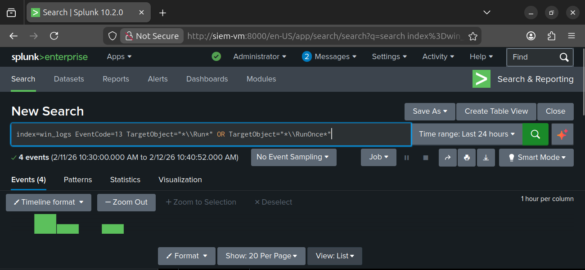
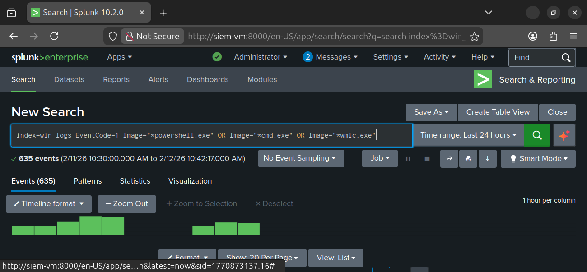
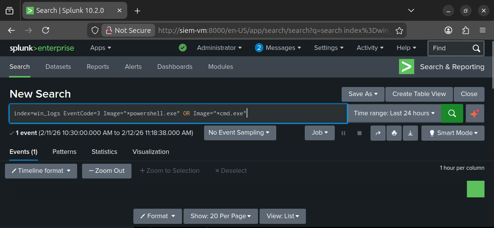

# 🛡️ Project 2 – Sysmon Configuration & Splunk Detection (Execution & Persistence)

## 📖 Scenario Overview – The Four Characters

This project simulates detection of malicious activity during the **execution and persistence phases** of the attack lifecycle.  
Sysmon was configured with custom RuleGroups, and Splunk was used to ingest and query logs for proof of detection.

- 👤 **Commoner (Employee / End User)**  
  Performs routine actions but unknowingly triggers suspicious processes and persistence mechanisms.

- 🎭 **Attacker (Threat Actor)**  
  Attempts to establish persistence and execute commands using registry keys, PowerShell, and network connections.

- 👩‍💻 **Tier‑1 Analyst (First Responder)**  
  Detects unusual registry modifications and suspicious command execution in Sysmon logs.

- 👨‍💻 **Tier‑2 Analyst (Investigator)**  
  Confirms detections, maps them to **MITRE ATT&CK techniques**, and escalates for containment.

---

## 🛠️ Tools & Environment Setup

- **Sysmon**
  - Event IDs:
    - **11 (FileCreate)** – EICAR test file
    - **13 (RegistryEvent)** – Persistence via Run/RunOnce keys
    - **1 (ProcessCreate)** – Suspicious command execution, scheduled tasks, privilege escalation
    - **3 (NetworkConnect)** – Outbound connections
    - **22 (DNS Query)** – Suspicious DNS lookups

- **Splunk**
  - Ingests Sysmon logs
  - Queries used to detect suspicious activity

- **MITRE ATT&CK Mapping**
  - **T1547** – Persistence via Registry Run Keys  
  - **T1053** – Scheduled Task Creation  
  - **T1078** – Privilege Escalation (runas)  
  - **T1059** – Command and Scripting Interpreter  
  - **T1071.004** – Application Layer Protocol: DNS  
  - **T1105** – Ingress Tool Transfer (EICAR test file simulation)

---

## 🔍 Detection Workflow

1. **Registry Persistence**  
   Attacker modifies Run/RunOnce keys for persistence.  
   Sysmon Event ID 13 logs the change.  
   Splunk query detects `TargetObject="*\\Run*"` or `TargetObject="*\\RunOnce*"`.

2. **Suspicious Command Execution**  
   Attacker uses PowerShell, cmd, or wmic for execution.  
   Sysmon Event ID 1 logs process creation.  
   Splunk query detects `Image="*powershell.exe" OR Image="*cmd.exe" OR Image="*wmic.exe"`.

3. **Network Connection**  
   Attacker initiates outbound connection via PowerShell or cmd.  
   Sysmon Event ID 3 logs the connection.  
   Splunk query detects `Image="*powershell.exe" OR Image="*cmd.exe"`.

---

## 📎 Evidence & Artifacts

All screenshots for this lab are stored in the [project2 folder](project2/).  

- `splunk-registry.png` → Registry persistence detection (EventCode 13)  
- `splunk-powershell.png` → Suspicious command execution detection (EventCode 1)  
- `splunk-network.png` → Network connection detection (EventCode 3)  
- Additional test file alerts (EICAR, AMTSO, FortiGuard, GTUBE, Sophos) stored in `proof/`  

---
## 🧑‍💻 Analyst Workflow

### Tier‑1 Analyst – Triage
  
*Tier‑1 analyst detects registry Run/RunOnce key modification in Splunk (EventCode 13, Persistence).*

---

### Tier‑2 Analyst – Investigation
  
*Tier‑2 analyst confirms suspicious PowerShell execution mapped to MITRE ATT&CK T1059 (Command and Scripting Interpreter).*

---

### Tier‑3 Analyst – Validation & Response
  
*Tier‑3 analyst validates outbound network connection attempt (EventCode 3). Activity mapped to MITRE ATT&CK T1071.004 (Application Layer Protocol – DNS/Network). Recommended response: block suspicious domains, tune detection rules, and investigate persistence mechanisms.*

---

## 🗂️ MITRE ATT&CK Mapping
- **T1547 – Persistence via Registry Run Keys**  
- **T1053 – Scheduled Task Creation**  
- **T1078 – Privilege Escalation (runas)**  
- **T1059 – Command and Scripting Interpreter**  
- **T1071.004 – Application Layer Protocol: DNS**  
- **T1105 – Ingress Tool Transfer (EICAR test file)**  

---

## ✅ Validation Checklist
- [x] Sysmon config applied with custom RuleGroups  
- [x] Registry persistence triggered and detected (Event ID 13)  
- [x] Suspicious command execution triggered and detected (Event ID 1)  
- [x] Network connection triggered and detected (Event ID 3)  
- [x] Splunk queries executed and results documented  
- [x] Screenshots stored in `project2/` folder  
- [x] Analyst workflow mapped to MITRE ATT&CK  

---

## 📊 Detection Summary

| Stage                  | Sysmon Event ID | Splunk Query Example                                                                 | MITRE ATT&CK Mapping          | Evidence Screenshot             |
|-------------------------|-----------------|--------------------------------------------------------------------------------------|--------------------------------|---------------------------------|
| Registry Persistence    | 13              | `index=win_logs EventCode=13 TargetObject="*\\Run*"`                                 | T1547 – Persistence            | proof/splunk-registry.png       |
| Command Execution       | 1               | `index=win_logs EventCode=1 Image="*powershell.exe" OR Image="*cmd.exe"`             | T1059 – Command Interpreter    | proof/splunk-powershell.png     |
| Network Connection      | 3               | `index=win_logs EventCode=3 Image="*powershell.exe" OR Image="*cmd.exe"`             | T1071.004 – DNS/Network        | proof/splunk-network.png        |

---

### 🔑 Key Takeaways

| Lesson | Why It Matters | Example in This Project |
|--------|----------------|-------------------------|
| Config tuning is critical | Sysmon rules define visibility | Registry Run/RunOnce detection |
| Execution monitoring | Detects attacker use of PowerShell/cmd | Event ID 1 detections |
| Network visibility | Outbound connections reveal attacker activity | Event ID 3 detection |
| MITRE mapping | Provides standardized language | ATT&CK T1547, T1059, T1071.004 |
| Documentation | Proof builds recruiter confidence | Screenshots in `proof/` folder |

---

## 🎯 Conclusion
This lab demonstrates detection of **execution and persistence techniques** using Sysmon + Splunk.  
By correlating Sysmon logs with Splunk queries and mapping to MITRE ATT&CK, you prove your ability to perform **SOC detection and incident analysis** during the mid‑attack lifecycle.

---

## 🤝 Connect With Me
- 🌐 GitHub: [LetsLearn-08](https://github.com/LetsLearn-08?tab=repositories)  
- 💼 LinkedIn: [Tanuja Reddy](https://www.linkedin.com/in/tanuja-reddy-03aa7b38a)
