# Project 6: DNS Traffic Analysis & Splunk Dashboard

## 🎯 Purpose
This project demonstrates how a SOC team can **capture, analyze, and operationalize DNS traffic** to uncover hidden anomalies.  
DNS is often exploited by attackers for **command-and-control channels, data exfiltration, and domain generation algorithms (DGAs)**. By exporting DNS events and building a Splunk dashboard, the project shows how raw traffic can be transformed into **structured intelligence** that reveals:  
- Randomized domains used by malware  
- Suspicious record types (TXT/NULL) often linked to tunneling  
- Sudden query spikes that indicate beaconing or brute-force attempts  

The goal is to highlight how **visibility into DNS traffic** can be the difference between spotting an attack early or missing it entirely.

---

## 📖 Story: The Phantom Queries
It started with a whisper in the logs — a handful of strange DNS requests that didn’t belong.  
Analyst **Raghu** noticed domains that looked like gibberish, strings of letters no human would type. At first, they seemed harmless, but then the frequency spiked.  
Meanwhile, **Tanuja** dug deeper in Splunk and uncovered bursts of TXT record queries, a classic sign of DNS tunneling. The attacker was trying to smuggle data out, hidden in plain sight.  
The SOC team raced against time. **Sivangi** exported the DNS events and built a dashboard that lit up with anomalies: randomized domains glowing red, rare record types standing out, and query spikes forming ominous patterns.  
The dashboard told the story — the attacker’s stealthy beaconing was exposed, and the SOC had the evidence to shut it down.  

---

## 🛠️ Environment Setup
- **Platform**: Windows VM (DNS Client), Kali VM (attacker)  
- **Tools Installed**: Splunk Forwarder, Splunk Enterprise  
- **Traffic Generated**:  
  - Normal queries (`A`, `AAAA`)  
  - Suspicious queries (`TXT`, `NULL`)  
  - Randomized domains (DGA simulation)  

### Screenshots
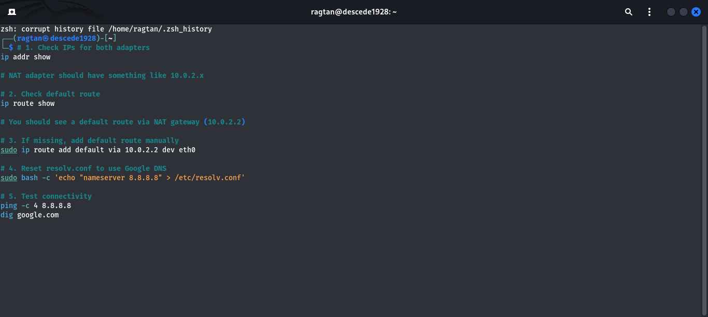  
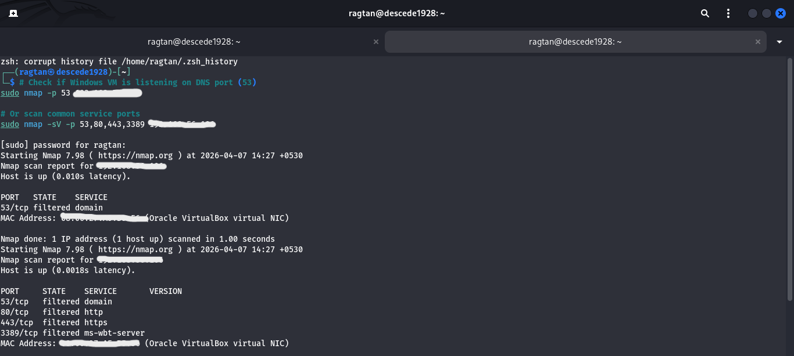  
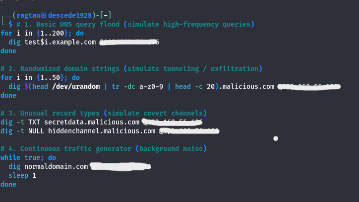  
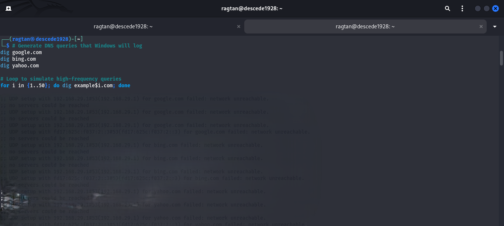  
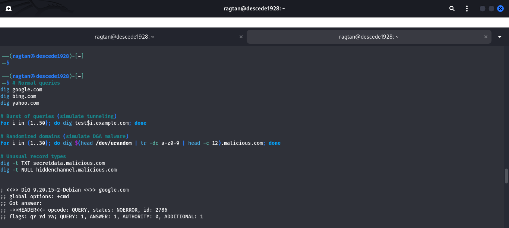  
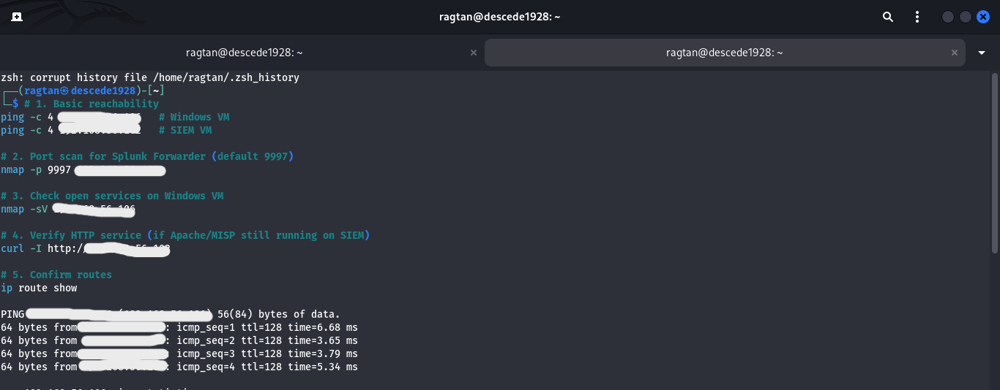  
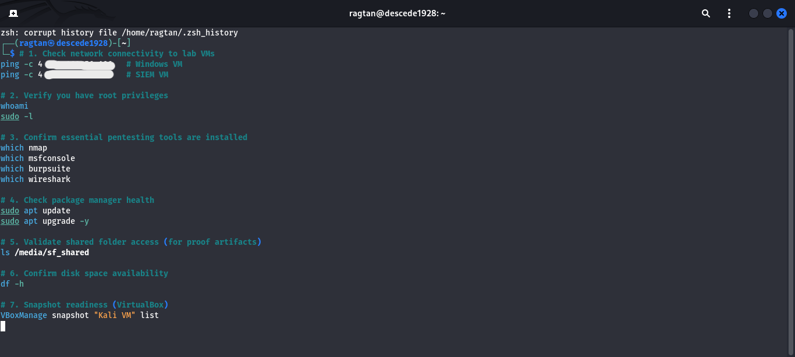  
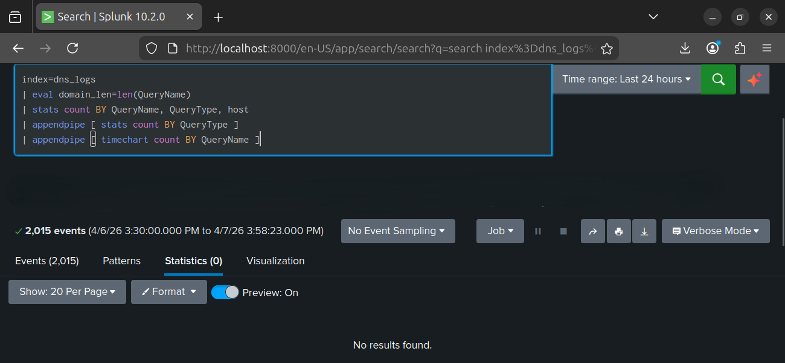  
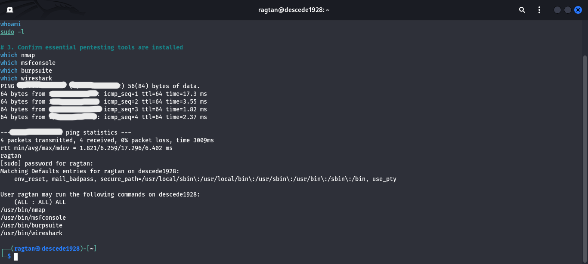  
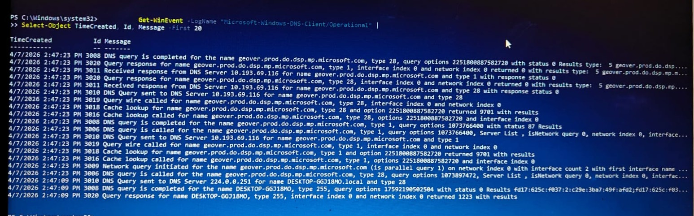  

---

## 📂 Splunk Dashboard
Created **Dashboard: DNS Anomaly Detection – SOC Lab** with the following panels:
- **Top Queried Domains** (bar chart)  
- **Query Type Distribution** (pie chart)  
- **Rare Record Types (TXT/NULL)** (table)  
- **Time-based Activity** (line chart)  
- **Entropy Detection (randomized domains)** (scatter plot)  

### Dashboard Artifacts
- 📄 **HTML Export**: [dns-anomaly-dashboard.html](Project6/dns-dashboard.html)  
- 🖼️ **PNG Screenshot**: 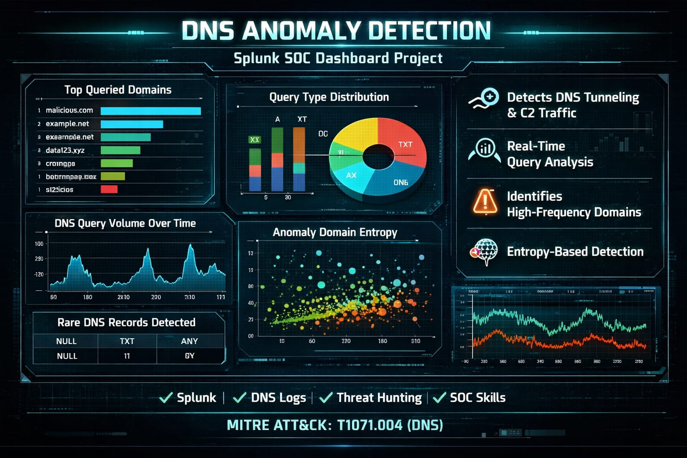  

---

## 📑 Proof of Artifacts
- Exported DNS events (CSV/JSON) from Splunk searches  
- Dashboard HTML file and PNG screenshot showing anomalies and normal traffic  
- Screenshots of attacker traffic generation and Splunk queries  

---

## 📚 Key Learnings
- DNS traffic is a **goldmine for detection** — attackers rely on it, defenders must master it.  
- Splunk dashboards transform raw logs into **visual intelligence** that SOC teams can act on.  
- Exported datasets (CSV/JSON, HTML, PNG) provide **examiner-ready evidence** for portfolio validation.  
- Simulating attacker traffic and correlating it in Splunk demonstrates **end-to-end SOC capability**.  

---

## 🤝 Connect with Me
I’m always excited to share knowledge, collaborate on cybersecurity projects, and explore new opportunities in SOC analysis, threat intelligence, and security automation.  
If you’d like to connect, discuss my work, or explore potential collaborations, here are my profiles:

- 🌐 **GitHub**: [LetsLearn-08](https://github.com/LetsLearn-08?tab=repositories)  
- 💼 **LinkedIn**: [Tanuja Reddy](https://www.linkedin.com/in/tanuja-reddy-03aa7b38a)  

Let’s learn, build, and secure together!
